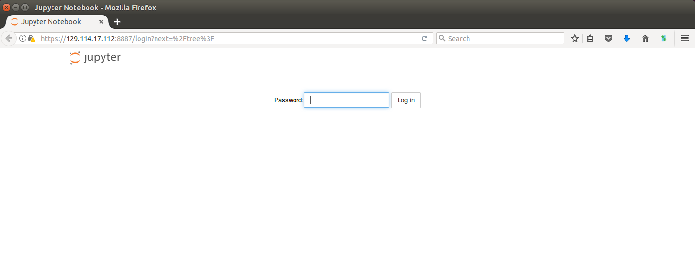

# The Linux Command Line and Installation of Jupyter

In this hands on lab, we'll get familiar with the Linux command line and manually install the software we'll be using in the afternoon. In a subsequent lab, we'll look at ways to automate the steps we are taking here.


### Files and Directories

On a Linux computer, files are organized into directories and subdirectories in much the same way as they are on Mac OS X or Windows. On our virtual machine, we interact with our files and folders using commands. Commands are always executed within the context of the "current location" of our shell. To see the current location, we use

```
ubuntu@test-jfs1:~$ pwd
/home/ubuntu
```

The `pwd` command outputs a `path` (in this case `/home/ubuntu`) of directories separated by slash (`/`) characters. From left to right, each subsequent directory is "contained" within the previous one. This is roughly analogous to `C:\Users\username` on Windows, or `/Users/username` on Mac.

We can list the contents of our current location with:

```
$ ls
```

My directory is empty so `ls` returns an empty response. To create an empty file named `test` in the current directory we use the `touch` command:

```
$ touch test
```

Now we can list the contents:

```
$ ls 
test
```

Similarly, we can make an empty directory with the `mkdir` command:

```
$ mkdir dir1
$ mkdir dir2
$ ls
dir1  dir2  test

```

We use the `cd` command to move between different directories or paths. The `cd` command takes an absolute or relative path as well as `..` for the "directory one up". Try some of the following examples:

```
$ cd dir1
$ pwd
/home/ubuntu/dir1
$ cd ..
$ pwd
/home/ubuntu
$ cd ..
$ pwd
/home
$ cd ubuntu/dir1/
$ pwd
/home/ubuntu/dir1
$ cd /home/ubuntu/dir2
$ pwd
/home/ubuntu/dir2
```

### Editing Files with vi 
The `vi` command is a basic utility for editing files. It has two modes: Insert and Command. To open a file for editing with `vi` simply type `vi path/to/file`

```
$ vi /home/ubuntu/test
```
To enter text, you must be in "insert" mode. To use commands such as "save", "quit", etc., you must be in command mode. Here are some basics:

  * Press the `i` key to go from command mode to insert mode. 
  * Press the `Esc` key to go from insert mode to command mode.
  * In insert mode, enter text as normal, or (in most environments) use the arrow keys to move around in the text.
  * In command mode, type `:w` to save a file `:wq` to save and quit vi.
  * Copy and paste text with `Ctrl+Shift+c` and `Ctrl+Shift+v` respectively (must be in insert mode to paste).


### Downloading files from the Internet

We can use the `wget` command to download a file from the internet. We simply pass the URL of the file to `wget` and file will be downloaded to the current location. 

For the course, we will be using the Anaconda scientific software distribution. Anaconda is a popular open source software package that comes with Python, Jupyter, and many of the most popular libraries for data science. (https://www.continuum.io/downloads)

Let's use wget to download the Anaconda installer:

```
$ cd /home/ubuntu
$ wget https://repo.continuum.io/archive/Anaconda3-4.4.0-Linux-x86_64.sh
. . .
Saving to: ‘Anaconda3-4.4.0-Linux-x86_64.sh’

100%[======================================>] 523,283,080 19.7MB/s   in 34s    

$ ls 
Anaconda3-4.4.0-Linux-x86_64.sh  dir1  dir2  test

```

This download should take less than a minute to complete. Once completed, `ls` will show us a new file called `Anaconda3-4.4.0-Linux-x86_64.sh` in our home directory. Note the `.sh` extension on the file name: this means that it is a shell script (more precisely, a BASH script) which we can execute. Do so now by using the `bash` command:

```
$ bash Anaconda3-4.4.0-Linux-x86_64.sh 
Welcome to Anaconda3 4.4.0 (by Continuum Analytics, Inc.)

In order to continue the installation process, please review the license
agreement.
Please, press ENTER to continue
>>> 
```
 * press enter, and then continue through the license by pressing enter. then type `yes` to accept
 * press enter again to accept the default location

This will commence with the main installation which will take some time. When prompted with:
```
Do you wish the installer to prepend the Anaconda3 install location
to PATH in your /home/ubuntu/.bashrc ? [yes|no]
```

answer `yes` to add all the Anaconda commands to your `$PATH`. (Sidebar -- discussion about what is `$PATH`?)


### The Anaconda package

Let's look around a bit at what just happened.

```
$ ls
anaconda3  Anaconda3-4.4.0-Linux-x86_64.sh  dir1  dir2  test
```
We see a new directory called `anaconda3` was created. Move in and of the directories and look around. The `anaconda3/bin` directory contains the commands (programs) that were installed and `anaconda3/pkgs` contains the software libraries.


### Configuring and Running Jupyter Notebook

We are going to use Jupyter notebook for the Python development we do in this course. Jupyter notebooks provide users with a tool for combining executable code with rich text formats such as markdown and HTML. You will hear a lot more about them in the afternoon.

For now, let's configure and run Jupyter in our VM. 

1. Create the initial Jupyter config:
```
$ cd ~/
$ source ~/.bashrc
$ jupyter notebook --generate-config
Writing default config to: /home/ubuntu/.jupyter/jupyter_notebook_config.py
```

2. Create a password for jupyter:
```
ubuntu@test-jfs1:~$ jupyter notebook password
Enter password: 
Verify password: 
[NotebookPasswordApp] Wrote hashed password to /home/ubuntu/.jupyter/jupyter_notebook_config.json
```

3. Create a self-signed certificate for Jupyter:
```
$ openssl req -x509 -nodes -days 365 -newkey rsa:1024 -keyout mykey.key -out mycert.pem
(press enter through all prompts)
Country Name (2 letter code) [AU]:
State or Province Name (full name) [Some-State]:
Locality Name (eg, city) []:
Organization Name (eg, company) [Internet Widgits Pty Ltd]:
Organizational Unit Name (eg, section) []:
Common Name (e.g. server FQDN or YOUR name) []:
Email Address []:
$
$ ls
anaconda3                        dir1  mycert.pem  test
Anaconda3-4.4.0-Linux-x86_64.sh  dir2  mykey.key
```

4. Get the password hash from your notebook config:
```
$ cat /home/ubuntu/.jupyter/jupyter_notebook_config.json
{
  "NotebookApp": {
    "password": "sha1:c8526f191..."
  }
```

And then use vi to modify the /home/ubuntu/.jupyter/jupyter_notebook_config.py with the following changes:

```
c.NotebookApp.certfile = '/home/ubuntu/mycert.pem'
c.NotebookApp.keyfile = '/home/ubuntu/mykey.key'
c.NotebookApp.ip = '*'
# copy from jupyter_notebook_config.json
c.NotebookApp.password = u'sha1:bcd259ccf...<your hashed password here>'
c.NotebookApp.open_browser = False
c.NotebookApp.port = 8887
```

5. Start Jupyter with the following command:
```
$ jupyter notebook &
```

6. Navigate to `https://<your_ip>:8887`. You will be warned by your browser that this is not secure. That is OK - add the security exception. After doing so you should see a Password prompt and a Log In button.

<center></center>

