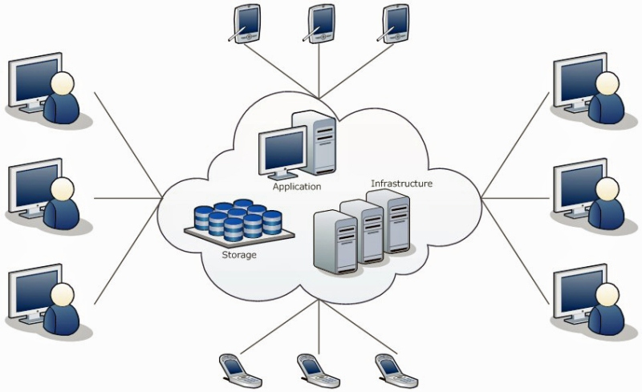
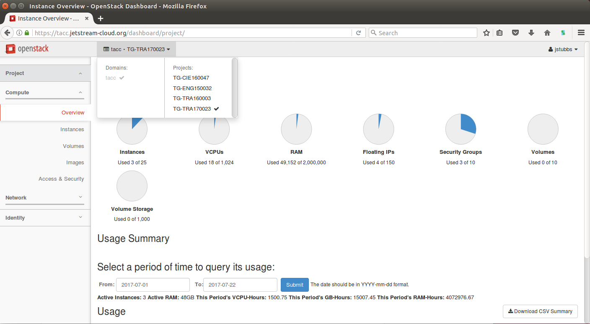
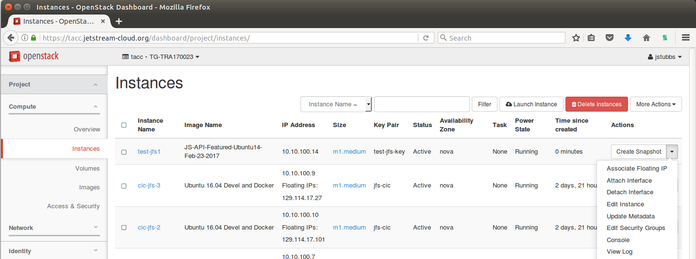

# Introduction to Cloud Computing


This module will be partially interactive. Please follow along on your own computer. After taking this module, participants should be able to:

 * Print, identify, and modify environment variables
 * List and search for available modules
 * Load and unload modules specific to a certain objective
 * Automate module and environment commands in the `.bashrc`
 * Prepare and submit a batch job to a queue
 
 
### What is a cloud?

A "cloud" is a computer system that provides users with shared access to on-demand computing resources via the internet.


<center></center>


#### Goals/Benefits
  * Resource utilization
  * Scalability and Elasticity 
  * Reproducibility by way of Programmability
  * Reliability through redundancy
  

### Cloud Means Different Things to Different Groups

Different kinds of people use clouds for different purposes.
  * System Administrators - use cloud to automate operations.
  * Software Developers - build applications on cloud servers and platforms.
  * Computational scientists - Write codes to analysis scientific data in the cloud.

In this course we will try to exposure you to each of these views.

### Cloud service models

Clouds can offer different service models:
  * Infrastructure-as-a-service (Iaas) - virtual servers, networks, firewalls, etc. (AWS, Azure)
  * Platform-as-a-service (Paas) - deploy applications without managing virtual servers (Google App Engine, Heroku)
  * Software-as-a-service (Saas) - Ready to use software application (Gmail, Office365)

Also: emerging models such as functioni-as-a-service.

### Infrastrcture-as-a-service

Key concepts:
  * Virtual Machines (VMs) - Simulate a physical computer through software.
  * Software defined networking: Routers, networks and subnets - used to connect VMs to other computers.
  * Security groups - firewall rules enabling or disabling network traffic to/from ports on the VMs.
  
### Hands on: Launching a VM on the JetStream cloud

1. Navigate to the JetStream Horizon interface: https://tacc.jetstream-cloud.org
2. Login with your tacc User Name and Password and enter "tacc" for the Domain.
3. Make sure you see our Training project (TG-TRA170023) in the projects drop down at the top and select it if it is not already selected (check mark):
<center></center>
4. Select Access & Security -> Key Pairs -> Create Key Pair. Give your key a name and click "Create Key Pair". When prompted, download the key file to your local desktop or click the Download link.
5. Instances -> Launch Instance.
  * Details: give your instance a name and click Next (Don't click launch instance)
  * Source: Enter JS-API-Featured-Ubuntu14-Feb-23-2017 in the search and click the plus (+) to select that image.
  * Flavor: Click the plus next to m1.medium
  * Networks: Choose the TG-TRA170023-subnet by clicking plus.
  * (Skip Network Ports by clicking next)
  * Security Groups: Select default security group.
  * Key Pair: Select the key you just created in step 4.
  * Click Launch instance.
6. Once the VM has been spawned, click the arrow at the far right to select "Associate Floating IP" from the available instance actions.
<center></center>
7. Select an IP in the drop down (if there is not one, click the plus (+) symbol to allocate one) and click Associate.


### Hands on: verifying connectivity to the VM

Use the SSH key and IP address you generated in steps 4 and 7 above, respectively to test connectivity to your new VM.

OSX/Linux:

```
 Open the application 'Terminal'
  # make sure your key file has the correct permissions:
  $ chmod 0600 chmod 0600 ~/Downloads/<key_name>.pem
  # connect to the VM over SSH
  $ ssh -i ~/Downloads/<key_name>.pem ubuntu@<IP address>
```

Windows:

```
 Open the application 'PuTTY'
  enter Host Name: <IP address>
  (click 'Open')
  (enter "ubuntu" username)
  (select your key)
```

If all goes well you should see a command prompt that looks something like:

```
Last login: Sat Jul 22 17:52:45 2017 from dhcp-146-6-176-22.tacc.utexas.edu
ubuntu@test-jfs1:~$ 
```

