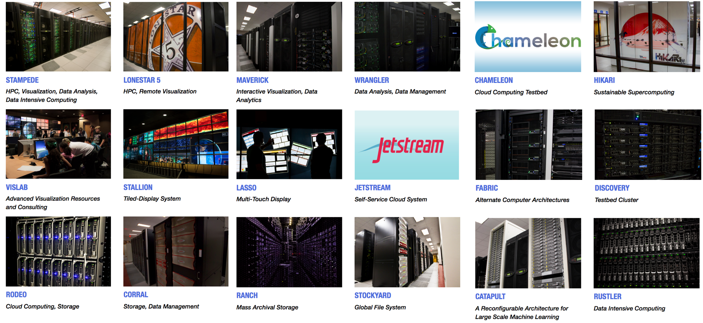

### Introductions

Instructors:

  * Joe Stubbs - Research Associate, Team Lead for the Cloud and Interactive Computing group
  * Charlie Dey - Research Engineering Scientist Associate, Training and Education Specialist.
  * Greg Zynda - Research Associate, Life Sciences Computing.
  * Josue Coronel - Portal Developer, Web and Mobile Applications.
  * Cody Hammock - Devops Engineer, Chameleon project technical lead
  * Mike Packard - Devops Engineer, Jetstream project technical lead
  * Julia Looney - Python Engineer, Cloud and Interactive Computing group

### What is the Texas Advanced Computing Center?

A little about us:

 * We are a research center at UT Austin
 * ~160 Staff, 85% funding from external grants
 * We support over 10,000 users on ~2,300 active projects

*Mission: "To enable discoveries that advance science and society through the application of advanced computing technologies."*

### TACC - More than Just SuperComputing

  * High performance computing (HPC)
  * Cloud & interactive computing 
  * Data intensive computing
  * Visualization
  * Software development & optimization
  * Web/Mobile Apps & APIs
  * Life sciences 
  * Training & outreach
  * Consulting & professional services

### Systems at a Glance

